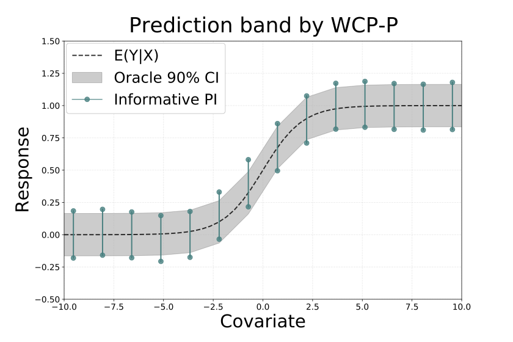

# Informativeness of Weighted Conformal Prediction 

## Paper link

[arxiv](http://www.example.com)

## Paper abstract

Weighted conformal prediction (WCP), a recently proposed framework, provides uncertainty quantification with the flexibility to accommodate different covariate distributions between training and test data. However, it is pointed out in this paper that the effectiveness of WCP heavily relies on the overlap between covariate distributions; insufficient overlap can lead to uninformative prediction intervals. To enhance the informativeness of WCP, we propose two methods for scenarios involving multiple sources with varied covariate distributions. We establish theoretical guarantees for our proposed methods and demonstrate their efficacy through simulations.

## Figures and codes

### Demonstration: constructed WCP intervals can be uninformative

We provide jupyter notebooks in folder ./wcp_demon. We demonstrate when the overlap between covariate distributions of training and testing is reduced, the probability of getting uninformative prediction intervals increases.

  
  
  

### Proposed methods: WCP-SB (WCP based on selective Bonferroni procedure) and WCP-P (WCP based on data pooling)

When training data includes multiple sources - varied covariate distribution but consistent conditional distribution of $Y$ given $X$, we propose two methods to integrate information from different sources. For the purpose of demonstration, we consider an exmaple of two groups with one dimensional covariate and known likelihood ratios. Specifically, let $P_X^{(1)}$ and $P_X^{(2)}$ denote the covariate distributions of observed groups, and let $Q_X$ denote the covariate distribution of test group, with $P_{Y|X}$ representing the conditional distribution of $Y$ given $X$.   We specifies the distributions as follows:

$$ P_X^{(1)} = \mathcal{N}(-3, \sigma^2),~ P_X^{(2)} = \mathcal{N}(3, \sigma^2),~  Q_X = \mathcal{N}(0, 9),~  \text{and} ~~
    P_{Y|X} = \mathcal{N}(\text{sigmoid}(X), 0.01).$$

We consider $\sigma^2 = 1,4$ and sample size of observed groups $n_1=n_2 = 100$. We observe WCP based on each single group data can lead to uninformative prediction intervals, i.e., $(-\infty, \infty)$, while our proposed methods reduce the probability of getting uninformative prediction intervals. We present a set of prediction bands with $\sigma^2 = 4$.

  
  

  
  

### Numerical experiments

We provide jupyter notebooks and bash files in folders ./two_groups, ./multi_group_one_dim, and ./multi_group_high_dim respectively.  For the example with higher covariate dimension  and unknown likelihood ratios, 
we use cluster to obtain the results. All results in numerical experiments are obtained through 5000 replications.

